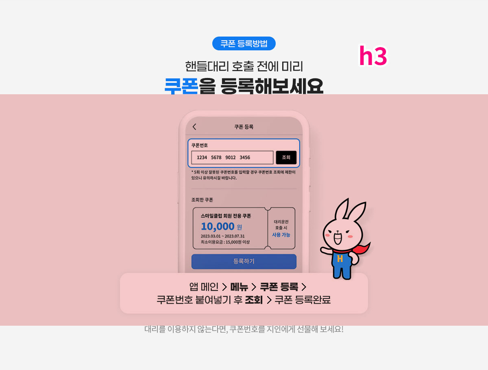
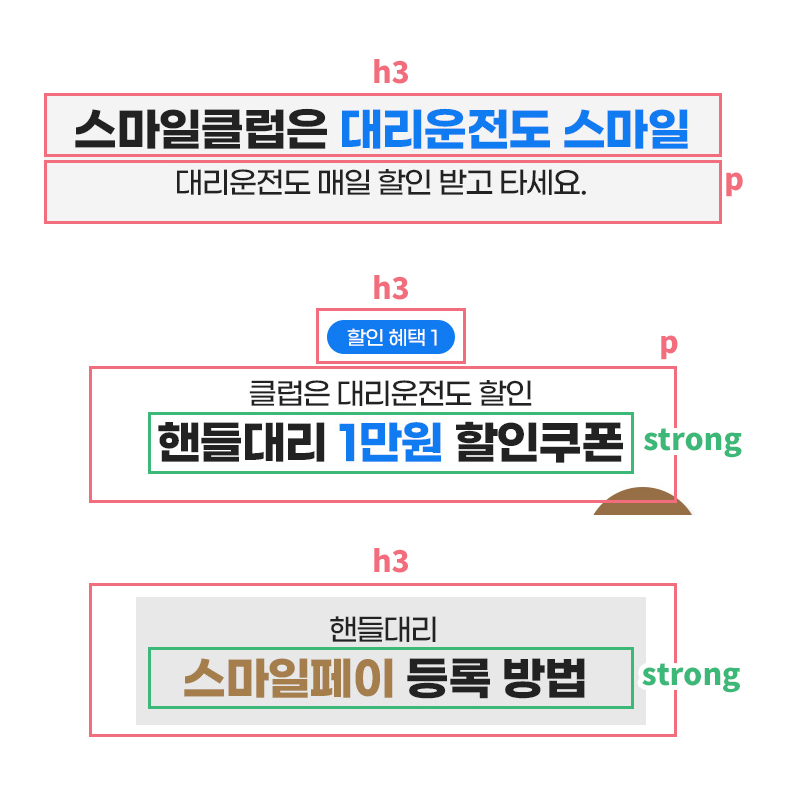
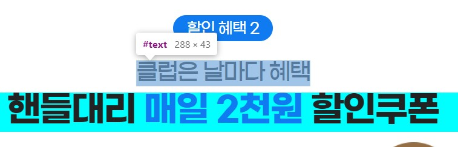

# 4월 핸들대리 전체리뉴얼 기록
* 지라
  - [ADR-40841](https://jira.ebaykorea.com/browse/ADR-40841)
* 완성된 목업url
    - PC : [230401_index.html](http://eventimg.auction.co.kr/md/auction/44ADB431BD/230401_index.html)
    - 모바일 : [230401_mobile.html](http://eventimg.auction.co.kr/md/auction/44ADB431BD/230401_mobile.html)

<br>

## 시안
전체 리뉴얼 치곤 기존 방식에서 벗어나지 않고 영역만 추가된 디자인이었다.<br>
그래서 기존 마크업들을 똑같이 해도 되지 않을까 한 생각도 들었으나(그러면안됨)<br>
대신 모든걸 이미지로 넣어져 있던 방식이었기 때문에..<br>
옥션에서 업로드 되어있는 폰트들인지 확인하고 그거에 따라서 폰트쓰기로 함.<br>

* 공통
  - 사용 된 폰트 : 지마켓산스, 노토산스
* pc
  - max-width : 2000px
  - min-width : 1200px
* mo
  - max-width : 720px
  - 모바일에만 스와이퍼가 있음

<br>

## 작업방식
이번 프로모션 리뉴얼은 운이 좋게도 모두 옥션에 등록되어있는 웹폰트들이었다.<br>
그래서 타이틀(텍스트) - 이미지(img) - tip같은 자잘글(텍스트)의 패턴으로 하기로 정함.<br>
색부분 입힌것이 이미지로 진행할 부분이다.<br>


<br>

### 좀 어려웠던 부분
1. 타이틀 디자인이 3개나 있었다.
    - 통일성이 없어서 타이틀 안의 스타일링을 is방식으로<br>
      클래스들을 몰아서 썼었다. (모듈화에 있어서 올바른 방식이 아님)
    - 타이틀 클래스명도 달라질 것을 우려하여 '헤더타이틀'이란 클래스이름을 안쓰고,<br>
      title 으로만 클래스명을 지었다.(다시생각해보니 별 상관 없었을듯하다.)<br>
    

<br>

2. 텍스트들의 폰트매트릭스와 라인헤이트
    - 학원에서 배웠던 라인헤이트 계산 방식과 매우 맞지않았다.<br>
      웹상에서 라인헤이트를 주면 위, 아래로 골고루 나눠 갖는다 들었는데<br>
      몇몇 폰트들은 (G마켓산스) 라인헤이트가 아래로 좍 쏠려있었다.<br>
      그것들을 무시하고 하던 계산방식대로 했다가 시안과 매우 큰 차이가 났다.
      <br>
      

<br>

3. 스마일페이 등록, 결제방법 영역
  - PC : 위에는 글, 아래는 그림으로 되어있으며<br>가로로 나열된 리스트 방식.
  - M: 위에는 그림, 아래는 글로 되어있으며<br>스와이퍼로 넘기는 리스트 방식.
  - 이때 좀 강박관념이 생겼어서 PC는 텍스트와 이미지로 작업했지만,<br>
    모바일은 전부 이미지로 잘랐다.


<br>

## 피드백
피드백은 총 2차로 진행되었으나 정리차원으로 걍 다 합침

### html
1. 접근성 텍스트(.blind)
* 이미지에 적힌 내용들 전부 적으며, 자연스럽게 이어지도록 넣는것이 중요.
  - `h2(헤더타이틀)`: 일부만 쓴것들을 전체 넣었다.
    - (옥션x핸들대리 콜라보 로고와 캐릭터 말풍선 영역등등)
  - `area-coupon-benefit(할인혜택1, 2)`쿠폰이미지 내용 수정.
    - 쿠폰이미지 중 "10,000원", "매일 2,000원" 부분은 제목이 아니기때문에<br>
      `<dd>`태그로 내렸다.
    - 우측에 있는 "대리운전 호출 시 사용가능" 부분은 조건식이기 때문에<br>
      `<p>`태그로 변경하였다.
  - `area-reserve-benefit(적립혜택)`: 중요문구 추가.
    - "누구나", "스마일 카드 결제하면" 부분을 `strong`으로 넣었다.<br>
      (쿠폰이미지의 중요 타이틀이었다.)
    - 타이틀 아래의 굵은 폰트는 `em`으로 변경하여 표기하였다.

2. Class Name BEM
* 하위 자식이 '앨리먼트'일떈 앨리먼트 표시인 언더바 2개 ( `__` ) ,<br>
  단순 구분자(구분하는 용도)는 모디파이어 표시인 하이픈 2개 ( `--` )
  ```html
  <!-- 제일 대표적인 예시 - 하위자식 앨리먼트 표현 -->
  <ul class="???-list">
    <li class="???-list__item"></li>
  </ul>
  ```
* 앨리먼트 표기로 변경한 부분
  - `.info-box`부분 변경하여 더 모듈화에 적합하게 만들었다.
    ```html
    <div class="info-box">
      <div class="info-box__wrap">
        <p class="info-box__text"></p>
      </div>
    </div>
    ```
* 모디파이어 표기로 변경한 부분<br>
  ```
  ☝이슈☝
  이번 작업에서는 모디파이어 보단 단순 구분자 클래스를 추가해버려서 못했다.
  그래서 다음 작업 시 구분이 필요할 경우 모디파이어로 작업할 것!

  benefit-01, benefit-02
  register-01, register-02, register-03, register-04
  payment-01, payment-02, payment-03, payment-04
  ```
  - `area-benefit`의 하위 division들을 구분하기 위해 모디파이로 변경할 것.
    ```html
    <div class="area-coupon-benefit">
      <div class="division-fence">
        <!-- benefit-01 -->
        <div class="division-benefit--01"></div>

        <!-- benefit-02 -->
        <div class="division-benefit--02"></div>
      </div>
    </div>
    ```
  - `area-smilepay-info`들 두개도 마찬가지. <br>
    area영역 두개가 있어서 모디파이로 했었어야 했다.
    ```html
    <!-- info__register -->
    <div class="area-smilepay-info--register"></div>

    <!-- info__payment -->
    <div class="area-smilepay-info--payment"></div>
    ```
      - 이렇게 했었다면, 각 area 안에 들어있던 `img-wrap`에는<br>
        `register-01~4`와 `payment-01~4`를 추가하지 않고도<br>
        '특성 선택자(영역선택자)'로 선택할 수 있었다.
        ```css
        [class$="--register"] .img-wrap:nth-child(1) {...}
        [class$="--payment"] .img-wrap:nth-child(1) {...}
        ```

3. 💥주의할점
* 이름의 방식들은 "무조건 끝자락만 변경"되어야 css 선택자가 편하다.
  - `area-coupon-benefit`와 `area-download-info`에 있는 `text-button`들
    - 수정 전 :<br>
      이렇게 하면 특성선택자로 선택할 수가 없다.
      ```html
      <buttom type="button" class="text-code-button"></button>
      <a htrf="#" class="text-enter-button"></a>
      <a htrf="#" class="text-download-button"></a>
      ```
    - 수정 후 :<br>
      특성선택자가 가능하며 각 끝의 이름대로 속성변경이 가능하다.
      ```html
      <buttom type="button" class="text-button__code"></button>
      <a htrf="#" class="text-button__enter"></a>
      <a htrf="#" class="text-button__download"></a>
      ```

<br>

### css


<br>

## 마무리