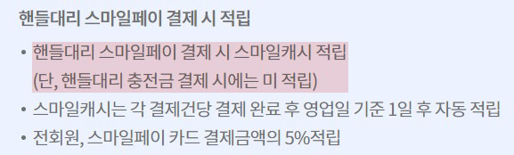
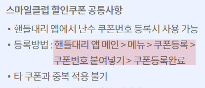
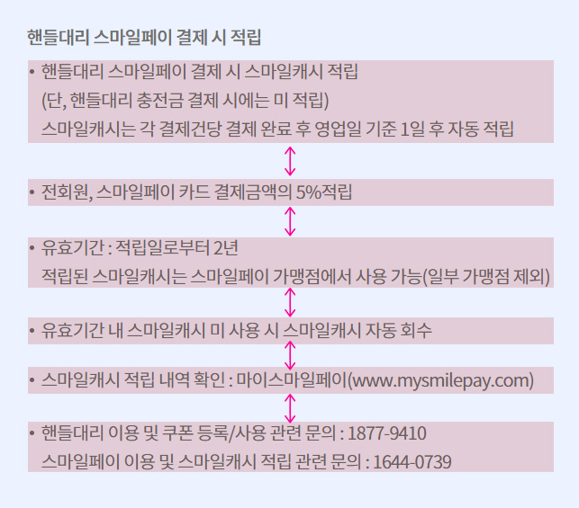

# 4월 핸들대리 전체리뉴얼 기록
* 지라
  - [ADR-40841](https://jira.ebaykorea.com/browse/ADR-40841)
* 완성된 목업url
    - PC : [230401_index.html](http://eventimg.auction.co.kr/md/auction/44ADB431BD/230401_index.html)
    - 모바일 : [230401_mobile.html](http://eventimg.auction.co.kr/md/auction/44ADB431BD/230401_mobile.html)

<br>

## 시안
전체 리뉴얼 치곤 기존 방식에서 벗어나지 않고 영역만 추가된 디자인이었다.<br>
그래서 기존 마크업들을 똑같이 해도 되지 않을까 한 생각도 들었으나(그러면안됨)<br>
대신 모든걸 이미지로 넣어져 있던 방식이었기 때문에..<br>
옥션에서 업로드 되어있는 폰트들인지 확인하고 그거에 따라서 폰트쓰기로 함.<br>

* 공통
  - 사용 된 폰트 : 지마켓산스, 노토산스
* pc
  - max-width : 2000px
  - min-width : 1200px
* mo
  - max-width : 720px
  - 모바일에만 스와이퍼가 있음

<br>
<br>

## 작업방식
이번 프로모션 리뉴얼은 운이 좋게도 모두 옥션에 등록되어있는 웹폰트들이었다.<br>
그래서 타이틀(텍스트) - 이미지(img) - tip같은 자잘글(텍스트)의 패턴으로 하기로 정함.<br>
색부분 입힌것이 이미지로 진행할 부분이다.<br>


<br>

### 좀 어려웠던 부분
1. 타이틀 디자인이 3개나 있었다.
    - 통일성이 없어서 타이틀 안의 스타일링을 is방식으로<br>
      클래스들을 몰아서 썼었다. (모듈화에 있어서 올바른 방식이 아님)
    - 타이틀 클래스명도 달라질 것을 우려하여 '헤더타이틀'이란 클래스이름을 안쓰고,<br>
      title 으로만 클래스명을 지었다.(다시생각해보니 별 상관 없었을듯하다.)<br>
    

<br>

2. 텍스트들의 폰트매트릭스와 라인헤이트
    - 학원에서 배웠던 라인헤이트 계산 방식과 매우 맞지않았다.<br>
      웹상에서 라인헤이트를 주면 위, 아래로 골고루 나눠 갖는다 들었는데<br>
      몇몇 폰트들은 (G마켓산스) 라인헤이트가 아래로 좍 쏠려있었다.<br>
      그것들을 무시하고 하던 계산방식대로 했다가 시안과 매우 큰 차이가 났다.
      <br>
      

<br>

3. 스마일페이 등록, 결제방법 영역
  - PC : 위에는 글, 아래는 그림으로 되어있으며<br>가로로 나열된 리스트 방식.
  - M: 위에는 그림, 아래는 글로 되어있으며<br>스와이퍼로 넘기는 리스트 방식.
  - 이때 좀 강박관념이 생겼어서 PC는 텍스트와 이미지로 작업했지만,<br>
    모바일은 전부 이미지로 잘랐다.

<br>
<br>

## 피드백
피드백은 총 2차로 진행되었으나 정리차원으로 걍 다 합침

### 📒 html
1. 접근성 텍스트(.blind)
    * 이미지에 적힌 내용들 전부 적으며, 자연스럽게 이어지도록 넣는것이 중요.
      - `h2(헤더타이틀)`: 일부만 쓴것들을 전체 넣었다.
        - (옥션x핸들대리 콜라보 로고와 캐릭터 말풍선 영역등등)
      - `area-coupon-benefit(할인혜택1, 2)`쿠폰이미지 내용 수정.
        - 쿠폰이미지 중 "10,000원", "매일 2,000원" 부분은 제목이 아니기때문에<br>
          `<dd>`태그로 내렸다.
        - 우측에 있는 "대리운전 호출 시 사용가능" 부분은 조건식이기 때문에<br>
          `<p>`태그로 변경하였다.
      - `area-reserve-benefit(적립혜택)`: 중요문구 추가.
        - "누구나", "스마일 카드 결제하면" 부분을 `strong`으로 넣었다.<br>
          (쿠폰이미지의 중요 타이틀이었다.)
        - 타이틀 아래의 굵은 폰트는 `em`으로 변경하여 표기하였다.

<br>

2. Class Name BEM
    * 하위 자식이 '앨리먼트'일떈 앨리먼트 표시인 언더바 2개 ( `__` ) ,<br>
      단순 구분자(구분하는 용도)는 모디파이어 표시인 하이픈 2개 ( `--` )
      ```html
      <!-- 제일 대표적인 예시 - 하위자식 앨리먼트 표현 -->
      <ul class="???-list">
        <li class="???-list__item"></li>
      </ul>
      ```
    * 앨리먼트 표기로 변경한 부분
      - `.info-box`부분 변경하여 더 모듈화에 적합하게 만들었다.
        ```html
        <div class="info-box">
          <div class="info-box__wrap">
            <p class="info-box__text"></p>
          </div>
        </div>
        ```
    * 모디파이어 표기로 변경한 부분
      ```
      ☝이슈☝
      이번 작업에서는 모디파이어 보단 단순 구분자 클래스를 추가해버려서 못했다.
      그래서 다음 작업 시 구분이 필요할 경우 모디파이어로 작업할 것!

      benefit-01, benefit-02
      register-01, register-02, register-03, register-04
      payment-01, payment-02, payment-03, payment-04
      ```
      - `area-benefit`의 하위 division들을 구분하기 위해 모디파이로 변경할 것.
        ```html
        <div class="area-coupon-benefit">
          <div class="division-fence">
            <!-- benefit-01 -->
            <div class="division-benefit--01"></div>

            <!-- benefit-02 -->
            <div class="division-benefit--02"></div>
          </div>
        </div>
        ```
      - `area-smilepay-info`들 두개도 마찬가지. <br>
        area영역 두개가 있어서 모디파이로 했었어야 했다.
        ```html
        <!-- info__register -->
        <div class="area-smilepay-info--register"></div>

        <!-- info__payment -->
        <div class="area-smilepay-info--payment"></div>
        ```
          - 이렇게 했었다면, 각 area 안에 들어있던 `img-wrap`에는<br>
            `register-01~4`와 `payment-01~4`를 추가하지 않고도<br>
            '특성 선택자(영역선택자)'로 선택할 수 있었다.
            ```css
            [class$="--register"] .img-wrap:nth-child(1) {...}
            [class$="--payment"] .img-wrap:nth-child(1) {...}
            ```
    * 💥주의할점<br>
      이름의 방식들은 "무조건 끝자락만 변경"되어야 css 선택자가 편하다.
        - `area-coupon-benefit`와 `area-download-info`에 있는 `text-button`들
          - 수정 전 :<br>
            이렇게 하면 특성선택자로 선택할 수가 없다.
            ```html
            <buttom type="button" class="text-code-button"></button>
            <a htrf="#" class="text-enter-button"></a>
            <a htrf="#" class="text-download-button"></a>
            ```
          - 수정 후 :<br>
            특성선택자가 가능하며 각 끝의 이름대로 속성변경이 가능하다.
            ```html
            <buttom type="button" class="text-button__code"></button>
            <a htrf="#" class="text-button__enter"></a>
            <a htrf="#" class="text-button__download"></a>
            ```

<br>

3. 순서 있는 모든 것들은 반드시 '순서 있는 리스트`<ol>`'로 쓰기.
    - 위치 : `area-smilepay-info(스마일페이 등록방법, 결재방법 영역)`<br>
      PC 시안과 모바일 시안이 달라서 혼동이 많았다.
      - PC 시안
        - text-wrap이 위, img-wrap이 아래에있는 구성.
        - 넘버링을 따로 표기 후 스타일을 입힘.
      - 모바일 시안
        - img-wrap이 위, text-wrap이 아래에있는 구성.
        - 넘버링표기가 없으며 내용과 함께 합쳐져있음.
        - 숫자가 특수기호라 스크린리더기에서 읽히지 않음.
      - 피드백 받기전
        - PC는 `<ul>`태그로 작업, 모바일은 `<ol>`태그로 작업했다.
        - 이유는 스크린리더기를 사용하여 숫자가 중복해서 들리지 않게 각각 조절했기 때문.
      - 피드백 받은 후
        - 피씨와 모바일이 둘다 다르다고 해서 리스트종류를 나누는건 바람직하지 않다.
        - 피씨과 모바일 둘다 방법에 리스트, 즉 순서가 있는 리스트이므로<br>
          `<ol>`태그로 지정하는것이 맞다.

<br>

### 📒 css
1. ❗❗ 프로모션에서 ``태그 안 쓰며 CSS의 `background-image`위주로 작업한다.
    * 이유 :
      1. index.html을 두 번 고치는걸 방지한다.
          - 두번이란 것은 ``태그와 `.blind`를 말하는데,<br>
            변경될 이미지 파일명을 바꾸고 blind 텍스트도 수정해야 하는 번거로움이 있기 때문이다.
      2. 단순 디자인만 변경되는 경우라면<br>
      html파일을 의미없이 수정하는것을 방지한다.
          - html파일을 수정한다면, 수정한 html을 개발자에게 전달하여<br>
            운영에 반영을 해야한다.<br>
            이것은 쓸데없으며 나도 번거롭고, 개발팀도 번거롭다.
          - CSS 파일을 수정한다면, 바로 업로드해서 퍼지까지 하니 쉽게 반영이 된다.
          - 왠만한 수정요소는 CSS안에서 해결하는것이 좋다.
      3. 매달 진행하는 유지보수는 ``태그는 좋지 않음.

    <br>

    * 피드백 받은 이후
      - 모든 area 내에 존재하는 `` 태그는 삭제하였다.
      - 삭제한 이미지 태그 내에 `.blind` 를 사용하여 이미지 설명들을 추가.
      - 대게 감싸는 `division`태그 또는 새로운 태그를 추가하여,<br>
        `background-image`로 이미지 넣었다.

    <br>

    * 재단한 이미지의 용량은 100KB를 넘지 않는다.
      - 한 때 옥션에서는 이미지용량 제한이 있었는데, 그게 100KB였다.
      - 이미지치곤 100KB 넘는건 헤비한 편.
      - 피드백 이후
        - 100KB가 넘는 이미지들은 대부분 크게 자른PNG 파일들이었다.
        - 100KB이하 PNG는 제외, 100KB가 넘는 이미지들만 다시 재단했다.
        - 가장 바뀐것은 `area-smilepay-info(스마일페이)`부분이다.<br>
          리스트 이미지들이 그림자 포함한 png 파일이었는데<br>
          전부 이미지만 jpg로 재단 후 그림자표현은 CSS로 처리하였다.

    <br>

      * `box-shadow(박스쉐도우)`와 그림자
        - `box-shadow`를 준 영역 :
          - `.area-intro`의 `.intro-details`
          - `.area-smilepay-info`의 `.smilepay-list__item`
        - 그림자 표현 하는 방법
          ```css
          .test-box {
            border-radius: 15px;
            box-shadow: 3px 4px 15.36px 0.64px rgba(38, 38, 38, 0.16);
            overflow: hidden;
          }
          /*
          PSD그림자 효과를 CSS box-shadow, text-shadow 로 변환해주는 사이트.
          http://www.topcss.org/demo/shadow.html
          */
          ```
        - 그림자표현할 수 없는 이미지가 있을 경우
          - 시안 중 상자같이 반듯한게아니라 매우 복잡한 이미지일때를 말한다.
            - 예시영역 : `area-register-info`
          1. 시안에서 그림자가 어느정도 있는지 체크한다.
          2. 이미지에서 +10px ~ +20px까지 더 크게 주고 png로 재단한다.
          3. 이런 경우의 이미지 재단은 따로 표시를 남겨주는게 좋으며<br>
            비슷한 경우가 생길 시 영역표기한만큼 재단하겠다는 룰을 정한다.

<br>

2. ❗❗ `line-height(라인헤이트)` 다시 살펴보기
    - 학원에서 배웠던 라인헤이트 계산법이 전부 옳지 않다.
    - 그래서 작업한것을 스샷 찍어서 포토샵에 대보는게 제일 나음.
    - G마켓 산스
      - css `line-height`를 설정해도 위아래로 분포해서 나오는것이 아닌,<br>
        포토샵처럼 전부 '아래로 쏠려' 있었다.
      - 이러는 경우에는 라인헤이트 계산법이 맞지 않으므로 포토샵과 비교하면서 조절해야한다.
    - ❗ 라인헤이트 초기화 (중요)
      - 절대로 삭제하지도 말고, 처음부터 설정해주는게 좋다.
      - 쓸데없는 폰트 여백들을 조여줄 수 있기 때문.
      ```css
      /*위치*/
      .wrapper {line-height: 1;}
      ```

<br>

3. `area` 영역마다 자동으로 배경색이 바뀌게 하기
    - 운영하는 동안 단(area)이 추가되거나 빠질 경우를 고려하여<br>
      각 단(area)의 배경색들이 알아서 바뀌게 한다.
    - nth-child로 가능하다.
      ```css
      [class^ = area-]:nth-child(odd) {
        background-color: #ecf2ff;
      }
      ```

<br>

4. `division-title`에 있는 타이틀 클래스 모듈화
    - 타이틀 클래스들의 이름
      - `title-keypoin`
      - `title-text-strong`
      - `title-text-text`
    - 변경하기 전
      - 타이틀 배치가 3개정도 있어서 전체 고정으로 가기 어려웠다.
      - 그 중 대다수가 `title-keypoin` 포함된 타이틀이 있는데<br>
        (할인혜택1 ~ 핸들대리 앱 다운방법 까지)<br>
        해당부분만 (IS기법 과비슷하게)common 영역에서 클래스들을 모아서 한번에 적용시켰다.
        ```css
        .area-coupon-benefit .title-text__text,
        .area-register-info .title-text__text,
        .area-reserve-benefit .title-text__text,
        .area-download-info .title-text__text {margin-top: 24px;}
        ```
    - 피드백
      - 일일히 클래스를 작성하면 유지하는 기간에도 계속 css에 추가하게되서 번거롭다.<br>
        모듈에 적합하지 않는 방식이다.
      - CSS 인접 형제 선택자(`+`)로 가능하다.
        - `title-keypoin`는 첫번째 형제이므로 `title-keypoin`이 있는 타이틀에만 적용 가능하다.
        - 두번째 형제(`title-text-text`) 부터 추가 스타일이 적용된다.
        - 인접 형제 선택자가 `<li>`와 다른 응용방식이다.
        ```css
        /* 첫번째 형제 */
        [class^="area-"] .title-keypoin {...}

        /* 두번째 형제 */
        [class^="area-"] .title-text-text {...}

        /* 인접 형제 선택자 */
        [class^="area-"] .title-keypoin + .title-text-text {
          margin-top: 25px;
        }
        ```

<br>

5. 모든 버튼들은 영역을 더 키운다.
    - PC와 모바일 시안대로 딱 맞게 버튼 영역을 잡으면 생각보다 매우 작은 버튼이 된다.<br>
      작은 버튼은 그만큼 클릭이 쉽지 않아, 사용자 접근이 좋지 않다. (특히 모바일)
    - PC와 모바일의 버튼 영역은 버튼 이미지의 +10~20px까지 더 크게 키운다.
    - TIP
      - `padding`으로 먼저 키운 후 마진으로 패딩값을 빼준다.
        ```css
        [class^="area-"] [class^="text-button__"] {
          padding: 10px 15px;
          margin: -10px -15px;
        }
        ```
      - 이유
        - `padding`값으로 크기를 키우면 그만큼 시안에서 재야하는 값이 더 복잡해지기 때문.
        - `padding`에서 준 만큼 `margin`을 음수값으로 넣어서 빼주면,<br>
          시안에서 패딩영역을 제외할 수 있다. (굳이 패딩 준 영역까지 계산 안해도 됨)

<br>

6. 스와이퍼 버튼 `disabled` 표현
    - `disabled`기능 (클릭못함)은 맨 처음과 마지막 슬라이드에 위치한다.
    - 맨 처음, 마지막 슬라이드에 위치할 시 그에 해당하는 슬라이드 버튼들이 사라져있다.
    - 해당 부분을 표현할때엔 두가지 방법이 있다.
      ```css
        /* 방법 1 */
        [class^="area-"] .swiper-button-disabled {
          opacity : 0;
          visibility: visible;
          cursor : pointer;
        }

        /* 방법 2 */
        [class^="area-"] .swiper-button-disabled {
          display: none;
        }
      ```
    - 접근성차원에선 방법1이 좋으나 다시 생각해보면 아예 읽히지 않는 버튼이 더 나을수도 있음.

<br>

7. `area-notice` 공지 리스트에 관해
    - 시안에서 리스트 영역이 '볼리트 + 내용'으로 되어있는 경우 줄바꿈이 될 때<br>
      볼리트 밑으로 가는것이 아닌, '글이 시작한 위치 밑'으로 내려가는것이 대다수다.<br>
      

    <br>

    - css로 볼리트 표현하기
      - 줄바꿈이 있을때마다 일일히 클래스를 추가하는 것은 매우 비효율적이다. (노가다)
      1. 볼리트 모양은 `li::before`에서 만들고 `absolute`로 띄워준다.
      2. 띄워진 볼리트 공간만큼 `padding-left`로 안쪽여백을 만들어 글자를 민다.
      - 이렇게 하면 줄바꿈이 생길 때마다 패딩으로 인해 여백유지한채로 내려온다.
        ```css
        /* 볼리트 띄우기 */
        .area-notice .notice-desc .desc-list__item::before {
          position: absolute;
          left: 4px;
          top: 14px;
        }

        /* 볼리트 여백 */
        .area-notice .notice-desc .desc-list__item {
          padding-left: 16px;
          position: relative;
        }
        ```
        > 참고로 `text-indent`라는 스타일도 있다.<br>
        > 들여쓰기, 내어쓰기 하는 스타일인데 자세히 찾아봐야함

    <br>

    - 줄바꿈에 클래스(`.gap`)를 사용해도 되는 경우
      - 줄바꿈의 위치가 글보다 여백이 더 넓을 때.<br>
        
        ```html
        <span class="gap">쿠폰번호 붙여넣기 &gt; 쿠폰등록완료</span>
        ```
        ```css
        .area-notice .left .desc-list__item .gap {
          margin-left: 80px;
        }
        ```

    <br>

    - 알아둡시다 💡
      - 이번 시안에서는 `<li>`들의 간격들이 전부 일정하게 짜여있어서 라인헤이트로 작업을 하였지만,<br>
        아래와 같은 경우의 방식도 있다.<br>
      - `<li>`들의 간격과, `<li>`안에잇는 `text`의 간격 까지도 신경써야 하므로<br>
        `<li>`내의 `text`에게는 `line-height`,<br>
        `<li>`들에게는 인접 형제 선택자로 `margin`을 주는것이다.<br>
        


<br>

## 마무리
  * 모든 작업이 끝나고 검수까지 완료했을 때<br>
    반드시 작업 한것에서 '달라진 점'이 있다면 꼭 개발팀에게 전달해야한다.
    - 레이어 팝업이 있다는것을 알리기 위해<br>
      레이어 팝업에 있던 `display: none;`을 전부 풀었다.
    - Mock up 전달할 때
      - 마크업 전체를 바꾸었다고 전달하였다.
      - 마크업 내 레이어 팝업이 2개 있다고 전달하였다.