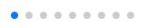
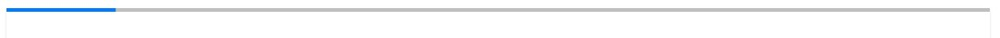
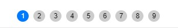

# 자주쓰는 스와이퍼 기능(API) 모음

## 파라미터(Parameters)
'매개변수' 라고도 한다.
스와이퍼의 데모안에서 볼 수 있는 옵션등등이다.

<br>

### 기본
<br>

* `slidesPerView`: 보여질 슬라이드 갯수, 이때 숫자를 지정하면 정해둔 가로길이가 슬라이드 기준으로 강제로 변환된다.
  - 숫자: 정수(양수)만 가능.
  - "auto": 자동설정이다. 이때는 슬라이드의 가로길이에 신경써야함.
* `slidesPerGroup`: 슬라이드 넘길 때 이동 갯수.
0개는 이동되지 않으며, 보여지는 슬라이드 갯수 또는 그 이상의 숫자는 한꺼번에 넘어감. (건너뛴다고 생각하면 됨)
  - 숫자: 정수(양수)만 가능.
  - 'cssMode'에선 사용 불가.
* `spaceBetween`: 슬라이드 간격 여백, 자동으로 설정되니 css작업때 간격을 미리 별려놓지 않는게 좋음. 단위는 px이다.
  - 숫자: 정수(양수)만 가능.
* `navigation`: 네비게이션 버튼 생성. 'nextEl, prevEl'에 커스텀한 버튼명을 넣으면 된다. (클래스, 아이디)
  ```js
  navigation: {
	nextEl: '다음 버튼 클래스(or아이디)이름',
	prevEl: '이전 버튼 클래스(or아이디)이름',
  }
  ```

<br>

### 추가설정
<br>

* `autoHeight`: 보여지고있는 슬라이드의 높이에 맞게 높이를 조정함
  - boolean(true, false)
* `direction`: 수평 또는 수직으로 스와이프 방향 설정함
  - horizontal
  - vertical
* `slideToClickedSlide`: 슬라이드를 클릭하면 클릭한 슬라이드가 액티브 위치로 이동
  - boolean(true, false)
* `centeredSlides`: 슬라이드가 가운데로 정렬됨
(시작 자체가 가운데에서 시작하기 때문에 만약 루프가 아니라면 왼쪽슬라이드가 없을거임)
  - boolean(true, false)
* `centeredSlidesBounds`: 시작과 끝에 비어있는거 없게 해줌.
(단, 시작과 시작의 다음 또는 끝과 끝의 이전의 슬라이드들은 이동 불가함)
(루프 불가능, 페이지네이션이 조금 먹통됨, 'centeredSlides'가 필수적으로 있어야함)
  - boolean(true, false)
* `watchOverflow`: 슬라이드가 1개일때 슬라이드버튼, 페이지네이션이 숨겨짐
  - boolean(true, false)
  - 스와이퍼4 에도 있음. 가능함.
* `slidesOffsetBefore`: 슬라이드 시작부분 여백. loop설정 시 마지막 슬라이드가 보일 수 있음.
  - number(양수)
* `slidesOffsetAfter`: 슬라이드 마지막부분 여백. loop설정 시 첫번째 슬라이드가 보일 수 있음.
  - number(양수)

<br>

* 터치 관련 설정
  * `allowTouchMove`: 스와이핑(마우스나 터치로 슬라이드 넘기는거)설정. false시 스와이핑 막힘, 버튼으로만 슬라이드 조작 가능.
    - boolean(true, false)
  * `touchRatio`: 비율적으로 스와이핑이 됨. 숫자가 높을수록 넘기는 양과 속도가 증가.
    - number(양수)

<br>

* LOOP 관련 설정
  - `loop`: 슬라이드 반복여부.
    - boolean(true, false)
      > #### ~주의할 것~
      > loop를 사용할 시 swiper-slide 의 css에 first, last, nth 등의 chaild선택하지 말것.
      loop가 되면서 순서가 바뀌어버리기 때문에 인식하기 어려움.
  - `loopAdditionalSlides`: 루프 생성 후 복제될 슬라이드 갯수. (슬라이드 반복 시 마지막 슬라이드에서 다음 슬라이드가 보여지지 않는 현상을 수정함)
    - 숫자: 정수(양수)만 가능
  - `loopFillGroupWithBlank`: 슬라이드 수가 부족한 그룹이 빈 슬라이드로 채워짐.
    'slidesPerGroup'와 같이 쓰면 좋음.
    - boolean(true, false)
  - `loopPreventsSlide`: 전환이 이미 진행 중일 때 슬라이드 이전/다음 전환이 방지됨.(loop가 활성화 된 경우 적용됨.)
    - boolean(true, false)
  - `loopedSlides`: loop모드에서 'slidesPerView:'auto''를 사용하는 경우, 'loopedSlides'를 사용하여 (loop을 돌리는 중복)슬라이드 갯수를 알린다.
    - number
    - null
  - `loopedSlidesLimit`: 복제된 슬라이드 수가 원래 슬라이드 수를 초과하지 않게 해줌.
    - boolean(true, false)

<br>

* `autoplay`: 자동슬라이드 설정이다. (비활성화시:false)
  - delay: 슬라이드 넘어가는 시간 설정 (단위:3000 -> 3초)
  - disableOnInteraction: 슬라이드를 수동으로 넘겼을때 계속 자동재생으로 활성화할건지 여부.
    (boolean이며 false 설정시 수동으로 슬라이드 넘겨도 알아서 자동재생됨
  ```js
  autoplay: {
          delay: 2500,
          disableOnInteraction: false,
        }
  ```

<br>

* `freeMode`: 슬라이드 이동할때 위치 고정 여부
  - boolean
  - FreeModeOptions : freeMode의옵션
    - enabled: 자유 모드를 사용할 수 있는지 여부, 'false'로 하면 살짝 브레이크 걸린 느낌난다.
      - boolean(true, false)
    - momentum: 'freeMode:true' 처럼 매우 매끄럽고 자유롭게 움직이게 설정.
      - boolean(true, false)
    - minimumVelocity: 자유 모드 모멘텀을 트리거하는 데 필요한 터치 이동 속도. 숫자가 올라갈수록 무겁게 이동됨
      - number (ex. 0.02)
    - momentumBounce: 이팩트. 드래그에 탄력성을 준다.
      'momentumBounceRatio'와 같이 설정해보고 힘차게 드래그 해보면 알게됨
      - boolean(true, false)
    - momentumBounceRatio: 'momentumBounce'의 강도(탄력성)를 높인다.
      - number(양수), 숫자가 높을수록 탄력성이 강해짐 (1과 20을 설정하고 보면 이해됨)
    - momentumRatio: 모멘텀의 거리를 조절함.
      - number(양수), 값이 클수록 슬라이더를 놓은 후 모멘텀 거리가 커짐
    - momentumVelocityRatio: 모멘텀의 속도를 조절함. 값이 클수록 슬라이더를 놓은 후 모멘텀 속도가 빨라짐.
      - number(양수), 값이 클수록 슬라이더를 놓은 후 모멘텀 속도가 커짐
    - sticky: 슬라이드 멈출때 슬라이드가 딱딱 맞아 떨어지게 멈춤. 좀 잘 쓰일듯
      - boolean(true, false)
  ```js
    const swiper = new Swiper('.swiper', {
    freeMode: {
      enabled: true,
      sticky: true,
      ...
    },
  ```

  <br>

* `breakpoints`: 반응형처리, 화면 크기마다 크기나 파라미터를 설정함.
  - slidesPerView, slidesPerGroup, spaceBetween, grid.rows등 같이 기본적으로 살짝 바꾸기 좋은 얘들만 변경 가능.
  - loop나 이팩트같은 파라미터는 작동 안할수도있음.
  >#### ~ breakpoints를 사용 시 주의할 점 ~
  > - '반대로' 해야함. 즉, 기존 설정이 width중 값이 제일 작은 값을 넣어야한다.
  > - 맨 아래 640는 PC상이다. 위로 올라갈수록 값이 작아짐
  ```js
  const swiper = new Swiper('.swiper', {
    // 기존 설정한거
    slidesPerView: 1,
    spaceBetween: 10,

    breakpoints: {
      // width값이 320 이상일 때 설정
      320: {
        slidesPerView: 2,
        spaceBetween: 20
      },
      // width값이 480 이상일 때 설정
      480: {
        slidesPerView: 3,
        spaceBetween: 30
      },
      // width값이 640 이상일 때 설정
      640: {
        slidesPerView: 4,
        spaceBetween: 40
      }
    }
  })
  ```

  <br>

* `a11y`: Accessibility(접근성)의 축약어, 접근성에 관한 옵션이다.
    - prevSlideMessage: 이전 버튼에 대한 메세지.
      - string(문자열): '이전 슬라이드'
    - nextSlideMessage: 다음 버튼에 대한 메세지.
      - string(문자열): '다음 슬라이드'
    - slideLabelMessage: 슬라이드가 몇번째인지 설명하는 메세지.
      - string(문자열): `'총 {{slidesLength}}장의 슬라이드 중 {{index}}번 슬라이드 입니다.'`
    - containerMessage: 외부 화면 판독기에 대한 메세지.
    - :
    - :
    - :
    - :
    - :
    - :
    - :
    - :
    - :
    - :
  ```js
  new Swiper('.swiper-container', {
    navigation: {
        nextEl: '.wrap-slide-box .swiper-button-next',
        prevEl: '.wrap-slide-box .swiper-button-prev',
    },
    a11y: {
        prevSlideMessage: '이전 슬라이드',
        nextSlideMessage: '다음 슬라이드',
        slideLabelMessage: '총 {{slidesLength}}장의 슬라이드 중 {{index}}번 슬라이드 입니다.',
    },
  })
  ```

  <br>

* `resistance`:
* `slideToClickedSlide`:
* `centeredSlides`:
* `allowTouchMove`:
* `watchOverflow`:
* `slidesOffsetBefore`:
* `slidesOffsetAfter`:

<br>

* `pagination `: 페이저버튼 (슬라이드갯수 만큼 있는 버튼) 스타일이 다양하다
  - 기본: 도트모양
    
    ```js
    pagination: {
          el: ".swiper-pagination",
        }
    ```
  - dynamic: 기본 도트형태로 액티브상태와 그 외의 상태가 확대/축소로 이루어져있음
    
    ```js
    pagination: {
          el: ".swiper-pagination",
          dynamicBullets: true,
        }
    ```
  - progress: bar형태로 슬라이드가 끝에 다다를때마다 bar의 색상이 채워진다. 루프슬라이드와는 어울리지 않음.
    
    ```js
    pagination: {
          el: ".swiper-pagination",
          type: "progressbar",
        }
    ```
  - fraction: 쪽수 형태로 전체슬라이드의 갯수와 현재 몇번째 슬라이드인지 표기됨.
    
    ```js
    pagination: {
          el: ".swiper-pagination",
          type: "fraction",
        }
    ```
  - `custom`: 기본 틀에서 벗어나 완전히 다른 구성을 할때 사용. 기본모형은 번호 동그라미지만, 숫자대신 문구를 넣을수도 있음.
    - 아래의 이미지와 예시는 커스텀의 기본설정이다.
    
      ```js
      pagination: {
            el: ".swiper-pagination",
            clickable: true,
            type:'bullets',
            renderBullet: function (index, className {
              return '<span class="' + className + '">' + (index + 1) + "</span>";
            },
          }
      ```
    - el : 페이져 버튼을 담을 태그 설정('.swiper-pagination'라는 div태그 안에 들어가게된다.)
    - clickable : 버튼 클릭 여부
    - type : 페이지버튼의 유형, 모양을 결정. ("bullets", "fraction", "progressbar", "custom")
    - `renderBullet` : 번호형(불릿형)의 기준으로 커스텀한다.
      페이지 번호와 필수클래스이름(className)을 허용하는 함수를 전달해야한다.
      불릿 형태의(차례대로 나열되어있는거)에 해당함.
      - 기본은 아래와같다.
        ```js
        renderBullet: function (index/*순서*/, className/*클래스이름짓기*/ {
                return '<span/*태그는 암거나 됨*/ class="' + className + '">' + (index + 1) + "</span>";
              },
        ```
        기본형은 html로 보면 아래와 같다.
        -index는 숫자 또는 변수array(자료형)의 순서에 쓰인다. (위의 예시는 index+1로, 1씩 더하고있다.)
        -className은 내가 클래스이름을 미리 지어놔야한다 (그래야 css나 이것저것이됨)
        -return 옆의 '<span>'태그가 디폴트이다. 내가 원하는 태그를 넣어도 된다.
        ```html
        <div class="swiper-pagination">
          <span class="className">1</span>
          <span class="className">2</span>
          <span class="className">3</span>
          ...
        </div>
        ```
      - 숫자가 아닌 텍스트로 작업할 경우
        ```js
        var 불릿에넣을것들 = ['사과', '오렌지', '딸기'];
        var swiper = new Swiper('.swiper-container', {
          pagination: {
            el: '.swiper-pagination',
            clickable: true,
            renderBullet: function (index, 클래스이름짓기) {
              return '<div class="' + 클래스이름짓기 + '"><span>' + (불릿에넣을것들[index]) + '</span></div>';
            }
          },
        });
        ```
        이렇게하면 위의 예시는 아래와같이 된다
        ```html
        <div class="swiper-pagination">
          <div class="클래스이름짓기">
            <span>사과</span>
          </div>
          <div class="클래스이름짓기">
            <span>오렌지</span>
          </div>
          <div class="클래스이름짓기">
            <span>딸기</span>
          </div>
        </div>
        ```
    - `renderFraction` : 'fraction'(쪽수) 형태의 페이져를 커스텀한다. 쪽수 유형에만 해당함.
      ```js
        renderFraction: function (currentClass/*현재슬라이드*/, totalClass/*전체슬라이드갯수*/) {
            return '<span/*태그는 암거나 됨*/ class="' + currentClass + '"></span>' +
                  '<span class="' + totalClass + '"></span>';
        }
      ```
    - `renderCustom` : 'Bullet'과 'Fraction'처럼 지정된것이 아닌 랜더링 자체를 지정해야 하는 페이지유형에 해당함.
      ```js
      renderCustom: function (swiper, current, total) { return current + ' of ' + total;
      }
      ```

<br>

* `Parallax`:


  <!-- ~스와이퍼 자주 쓰이는거~
  .on{}: 스와이퍼 이 외에 따른 이벤트같은거 넣을때 쓰임

  slideChange: 슬라이드가 바뀔때마다(=액티브가 될때마다) 이벤트가 실행

  slideChangeTransitionStart: 이전, 다음 슬라이드로 넘기기 시작할때 이벤트 발생
  slideChangeTransitionEnd: 이전, 다음 슬라이드로 넘어가서 끝날때 이벤트 발생

  slideNextTransitionStart: "slideChangeTransitionStart"와 같음, next만
  slideNextTransitionEnd: "slideChangeTransitionEnd"와 같음, next만

  slidePrevTransitionStart: "slideChangeTransitionStart"와 같음, Prev만
  slidePrevTransitionEnd: "slideChangeTransitionEnd"와 같음, Prev만

  스와이퍼이름.activeIndex: 현대 액티브가 된 슬라이드 번호, 근데 loop일때는 양이 늘어나서 번호가 바뀜
  스와이퍼이름.realIndex: 슬라이드 ㄹㅇ찐번호 loop적용중일땐 이거 쓰는게 나음

  스와이퍼이름.slideTo(index(슬라이드번호), speed(속도), runCallbacks(전환이벤트여부)): '특정'슬라이드로 이동함
  스와이퍼이름.slideToLoop(index(슬라이드번호), speed(속도), runCallbacks(전환이벤트여부)): '특정'슬라이드로 이동함(loop설정되어있을때 전용)

  스와이퍼이름.slidePrev(index, speed, runCallbacks): 이전 슬라이드로 이동
  스와이퍼이름.slideNext(index, speed, runCallbacks): 다음 슬라이드로 이동

  Keyboard Control: 이거 접근성보다는 그냥 키보드 방향키(좌,우)랑 pageUp,pageDown할때 슬라이드 넘기는거임
  watchOverflow: 슬라이드가1개라서 슬라이드가 되지 않을때 버튼,페이징버튼 숨겨짐 -->


<br>

* * *

<br>

## 메소드(Methods)
기본 옵션으로도 어려울때 추가적인 이벤트로 사용한다.
파라미터중 .on{}에다 넣기도한다. (이벤트 핸들러)

<br>

* * *

<br>

## 참고링크
* [자주쓰는 스와이퍼 API](https://velog.io/@function_dh/JavaScript-Swiper-%EC%82%AC%EC%9A%A9%EB%B2%95-%EC%8A%AC%EB%9D%BC%EC%9D%B4%EB%93%9C-%EA%B5%AC%ED%98%84)
* [스와이퍼 일부 API 설명(스와이퍼API에 없는설명이 있음)](https://blog.naver.com/PostView.nhn?blogId=sgj4958&logNo=221887217278&parentCategoryNo=&categoryNo=&viewDate=&isShowPopularPosts=false&from=postView)
* [스와이퍼 접근성작업 참고하기(개빡샘)](https://pxd-fed-blog.web.app/a11y-swiper-slide/)