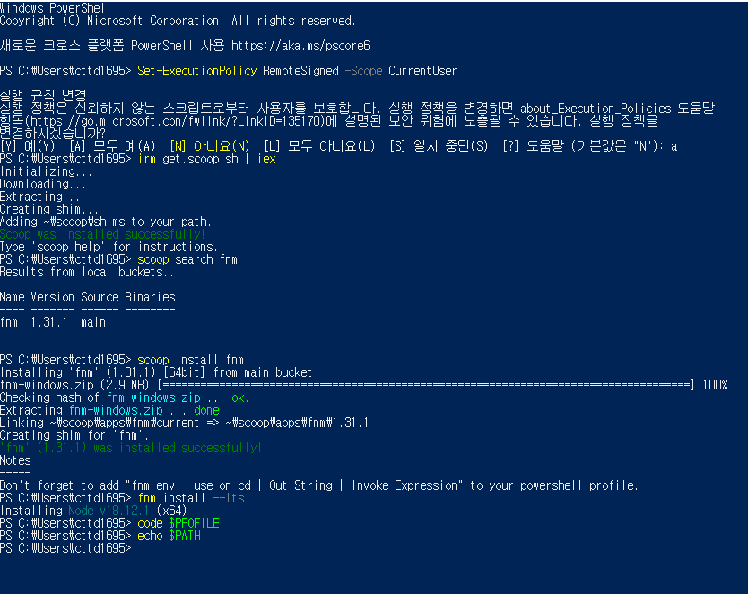
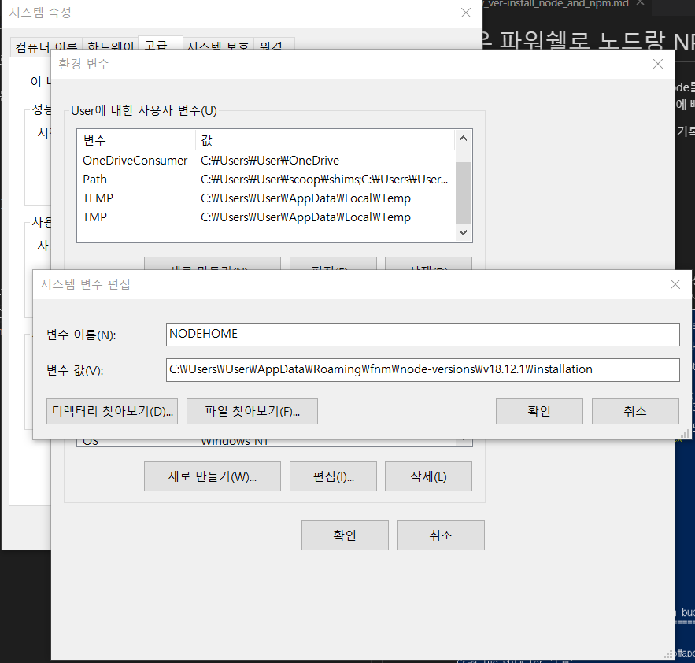

# 윈도우 파워쉘로 노드랑 NPM 설치하기
회사에서 SIV나 코오롱이나 뭐시기나 작업할때 기본으로 node를 사용한다.
그래서 걍 노드를 직접 사이트로 다운받아서 설치할 수 있지만,
회사에서는 작업마다 노드 버전이 다르기 때문에 빠른패키지매니저(fnm)를 설치해서 빠르게 설치한다구 한다.

그러나 mac만 쉽지 윈도우는 좀 어렵다. 그러므로 기록한다..

<br>

## 순서
* 실행할 커멘드: 윈도우 파워쉘 (Power Shell)
  - 윈도우 파워쉘은 윈도우 검색하면 바로 나온다.
* 설치하는 순서
  1. [Scoop 설치](#01-scoop-설치하기)
  2. [Scoop 에서 fnm 설치](#02-scoop-에서-fnm-설치)
  3. [fnm에서 Node 설치](#03-fnm에서-node-설치)
  4. [Node를 설치해도 막혔을때 - 시스템변수 설정](#04-node를-설치해도-막혔을때---시스템변수-설정)

### 👼 이미지 참고하기.
* 👼 강이사님의 은총
  
* 👼 베테랑 지인의 은총
  

<br>

## 🔑 설치를 합시다.

<br>

### 01. Scoop 설치하기
1. 파워쉘(Power shell)은 일반버전으로 킨다.
    - 관리자버전 아니라는 뜻이다. 그냥 클릭해서 킨다.
2. 파워쉘에 아래와 같이 입력한다.
    ```
    Set-ExecutionPolicy RemoteSigned -Scope CurrentUser
    ```
3. 그러면 파워셀에는 친절하게 한국어로 '실행규칙변경'을 할거냐고 물으며 다양한 선택지를 준다. 그러면 모두 예(A)를 선택한다.
    - a 만 누르고 엔터
4. a선택 후 아래와 같이 입력한다.
    ```
    irm get.scoop.sh | iex
    ```
5. 알아서 잘 설치한다. <br>
    - 만약 빨간색 표시의 에러가 나면 유감, 여러분의 상사님들께 물어봅시다.
    - *커멘드를 복사해서 왜 에러나 나는지 번역기에 붙여넣고 보는것도 도움 됨.*

<br>

> 왠만하면 사이트 직접 들어가서 메인페이지와 위의 스샷을 번갈아서 보는것을 추천.
> - 사이트 : https://scoop.sh/
> - 사이트에서 'Quickstart' 부분 보기.

<br>

### 02. Scoop 에서 fnm 설치
* Scoop이 잘 설치되었는지 확인하고싶다면 아래중 하나만 입력해 봅시다.
    ```
    > scoop         #다양한 명령어, 단축키 리스트들이 나옴
    > scoop -v      #설치한 scoop의 버전 확인
    ```

1. 일단 안전하게 fnm이 있나 검색해 봅시다. 아래를 입력하고 좀 기다려야함.
    ```
    scoop scarch fnm
    ```
2. 잘 나왔다면 이것도 입력. 설치하겠단 뜻입니다. (install)
    ```
    scoop install fnm
    ```
3. 설치가 잘 됐으면 초록글씨로 아래의 글이 나온다.
    ```
    "'fnm' (버전 숫자) was installed successfully!"
    ```
4. 설치 완료 후 설정 파일에 환경변수 세팅을 해주는 내용을 추가해야 한다.
    1. 환경변수 들어가기
        - vs코드 깔려있다면
            ```
            code $PROFILE
            ```
        - vs코드 없다면
            ```
            $PROFILE
            ```
        - 위의 두개가 안먹힌다면 직접 경로를 뚫는 수 밖에..<br>
        `Microsoft.PowerShell_profile.ps1`라는 파일찾는다.
            ```
            ~\Documents\PowerShell\Microsoft.PowerShell_profile.ps1

            # 나는 이렇게 되어있다
            C:\Users\User\Documents\WindowsPowerShell\Microsoft.PowerShell_profile.ps1
            ```
    2. 찾고 열었으면 아래와 같이 입력하고 저장하고 닫는다.
        ```
        fnm env --use-on-cd | Out-String | Invoke-Expression
        ```
    3. 이후 `echo $PATH` 를 입력해본다. (설정한 $PATH 보겠냐는 뜻이다. 근데 나는 안뜬다.)

> #### ❓ 환경변수가 뭔가요
> 환경변수는 즐겨찾기 추가 같은 개념이라 보면 될 듯.<br>
> 컴퓨터가 fnm이나 node를 설치해도 명령어를 못알아먹는 경우가 있다. (이거때매 매우 해맴)<br>
> 그래서 직접 컴퓨터의 환경변수창(환경설정같은거)을 열어서 이름과 경로를 지정해야한다.

<br>

### 03. fnm에서 Node 설치
* fnm이 잘 설치되었는지 확인하고싶다면 아래중 하나만 입력해 봅시다.
  ```
  > fnm         #다양한 명령어, 단축키 리스트들이 나옴
  > fnm -v      #설치한 fnm의 버전 확인
  ```

* 만약 꼭 설치해야 하는 노드(node) 버전이 있다면
    1. 내 컴퓨터에 깔 수 있는 노드 버전들 리스트를 뽑아서 있나 찾아봅시다.
        ```
        fnm list-remote
        ```
    2. 찾았다면 아래와 같이 입력하고 설치.
        ```
        fnm install 노드버전번호

        # 노드 설치 예시
        fnm install 17      # 17.xx.xx 버전 설치
        fnm install 17.3    # 17.3.xx 버전 설치
        ```
* 그런건 딱히 없고 최신판을 설치한다면
  ```
  fnm install --lts
  ```
* 참고
  - `npm`은 Node 설치할때 같이 설치됨.
  - [fnm 관련 명령어모음 + 사용법](https://www.freecodecamp.org/news/fnm-fast-node-manager)

<br>

### 04. Node를 설치해도 막혔을때 - 시스템변수 설정
fnm에서 Node까지 다 설치하면 끝인줄 알았는데, npm이나 node를 입력해도 에러가 뜨는 경우가 있다. (특히 윈도우는)<br>
그 오류를 자세히 들여다 보면 여러가지 뜻이 있는데, <br>
일단 나는 'node 라는거 못찾겠음' 이었다.

* 해결방법
  1. 윈도우검색창에 '시스템 환경 변수 편집' 검색 후 실행.
  2. 맨 아래 '환경변수(N)...' 버튼 클릭
  3. 그러면 사용자변수 와 시스템변수 두가지가 나오는데 그 중 시스템변수를 볼것이다.<br>
    시스템변수에 있는 '새로만들기(W)...' 버튼 클릭
  4. 변수이름과 변수 값 이라는 입력칸이 나온다.
      - 변수이름
        - 내맘대로 짓는데, 다들 주로 `NODEHOME` 이라고 짓는거 같다.
        - 대문자로 짓는다. 나중에 이름겹치면 골치아프다.
      - 변수 값
        - Node가 있는 경로를 입력하면 된다.
        - `C:\Users\User\AppData`안에서 찾아서 뒤져보면 나올것 같다.
        - 일단 나는 파워셀에 이미 설치한 노드를 일부러 중복설치를 했다.<br>
          그러면 이미 설치되었다는 에러와 함께 설치가 된 경로도 같이뜬다.<br>
          그걸 복사해서 폴더한번 열어보고 붙여넣었다.
            - 폴더에서 경로를 찾으면 'installation' 라는 폴더 안까지 들어가서 경로 재복붙한다.
        - 참고로 내 경로는 아래와 같이 나왔다.
          ```
          C:\Users\User\AppData\Roaming\fnm\node-versions\v18.12.1\installation

          # \가 \\ 이렇게 두번 나올땐 하나 지운다.
          ```
  5. 변수이름과 변수 값 입력 완료했으면 확인을 클릭한다.
  6. 잘 되었는지 확인하기 위해 파워쉘에 아래와 같이 입력해본다.
      - node 따로 npm 따로 파워쉘 창을 껏다 키면서 해야한다.(입력하면 바로 node와 npm 안에 들어가기 때문.)
      ```
      node
      npm
      ```

* 참고
  - 구글에 '윈도우에서 npm 실행 안됨' 이라고 검색하면 여러가지 버전으로 잘 나온다.<br> 위의 시스템변수 설정이 안먹힌다면 직접 찾아보거나 상사님한테 물어보는게 더 나을듯하다.
  - [검색해서 나온 환경+시스템변수 설정 링크](https://imspear.tistory.com/31)
