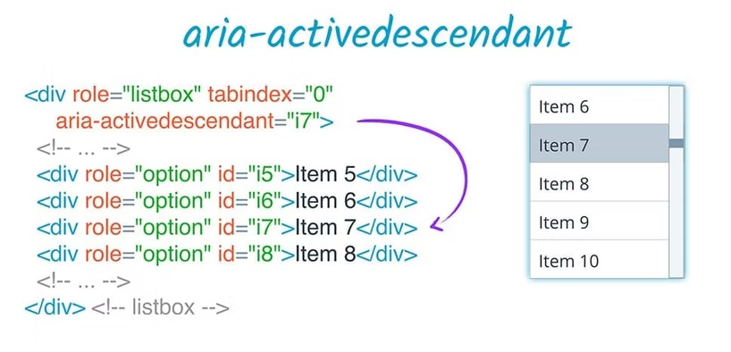

# aria 모음

✍✍✍✍✍~완성해야하는거~✍✍✍✍✍
- UI기준으로보기 채우기
- 모음+설명과 링크 연결하기

<br>

## UI 기준으로 보기
UI 기준으로 aria들이 어떤게 들어가있는지 참고하기  
[참고링크 - 널리WAI-ARIA UI](https://nuli.navercorp.com/tool/waiAria#)   

### 탭 (Tab)
#### role
* [필수] `tablist`: 탭 메뉴 리스트(ul같은 리스트)
* [필수] `tab`: 탭(li)
* [필수] `tabpanel`: 탭 내용물
* `none`: ul > li 구조에서 해당 역할을 하지 않는경우 필수

#### aria'
* [필수] `aria-selected`: 'true', 'false'로 선택 되어있는 상태/아닌상태를 나타냄
* `aria-orientation`: 요소가 가로형태인지, 세로형태인지, 알수없는지 여부를 알려줌
* `aria-controls`: 
* `aria-label` 또는 `aria-labelledby`: 

```html
<ul role="tablist">
	<li role="none"><a href="#" role="tab" aria-selected="true" aria-controls="tab_ui">탭1</a></li>
	<li role="none"><a href="#" role="tab" aria-selected="false" aria-controls="tab_ac">탭2</a></li>
	<li role="none"><a href="#" role="tab" aria-selected="false" aria-controls="tab_se">탭3</a></li>
</ul>

<div id="tab_ui" role="tabpanel" aria-labelledby="ui" tabindex="0">
	첫번째 탭 내용
</div>

<div id="tab_ac" role="tabpanel" aria-labelledby="ac" tabindex="0" style="display:none">
	두번째 탭 내용
</div>

<div id="tab_se" role="tabpanel" aria-labelledby="se" tabindex="0" style="display:none">
	세번째 탭 내용
</div>
```

<br>

## 글로벌하게 쓰임 (Global States and Properties)
어떤 역활 적용여부 관계없이 모든요소에 적용할 수 있는 aria속성들이다.   
기본 마크업 요소에서 지원이 된다.   
[참고링크 - 6.4 Global States and Properties](https://www.w3.org/TR/wai-aria/#states_and_properties)

<details>
  <summary>✨ 글로벌 속성보기</summary>
  <ul>
  <li>aria-label</li>
  <li>aria-labelledby</li>
  <li>aria-atomic</li>
  <li>aria-controls</li>
  <li>aria-describedby</li>
  <li>aria-details</li>
  <li>aria-dropeffect</li>
  <li>aria-errormessage</li>
  <li>aria-flowto</li>
  <li>aria-haspopup</li>
  <li>aria-keyshortcuts</li>
  <li>aria-live</li>
  <li>aria-owns</li>
  <li>aria-relevant</li>
  <li>aria-roledescription</li>
  <li>aria-busy (state)</li>
  <li>aria-current (state)</li>
  <li>aria-disabled (state)</li>
  <li>aria-grabbed (state)</li>
  <li>aria-hidden (state)</li>
  <li>aria-invalid (state)</li>
  </ul>
</details>

<br>

## 카테고리별 모음
Property와 State는 아래의 카테고리로 나뉘며 분류됨

<details>
  <summary>⚙ Widget Attributes (위젯)</summary>
  <ul>
  <li>aria-autocomplete</li>
  <li>aria-checked</li>
  <li>aria-disabled</li>
  <li>aria-errormessage</li>
  <li>aria-expanded</li>
  <li>aria-haspopup</li>
  <li>aria-hidden</li>
  <li>aria-invalid</li>
  <li>aria-label</li>
  <li>aria-level</li>
  <li>aria-modal</li>
  <li>aria-multiline</li>
  <li>aria-multiselectable</li>
  <li>aria-orientation</li>
  <li>aria-placeholder</li>
  <li>aria-pressed</li>
  <li>aria-readonly</li>
  <li>aria-required</li>
  <li>aria-selected</li>
  <li>aria-sort</li>
  <li>aria-valuemax</li>
  <li>aria-valuemin</li>
  <li>aria-valuenow</li>
  <li>aria-valuetext</li>
  </ul>
</details>

<details>
  <summary>⏰ Live Regions Attributes (실시간)</summary>
  <ul>
  <li>aria-atomic</li>
  <li>aria-busy</li>
  <li>aria-live</li>
  <li>aria-relevant</li>
  </ul>
</details>

<details>
  <summary>🖱 Drag and Drop Attributes (드래그앤 드롭)</summary>
  <ul>
  <li>aria-dropeffect</li>
  <li>aria-grabbed</li>
  </ul>
</details>

<details>
  <summary>🤙 Relationships Attributes (관계)</summary>
문서구조에서 쉽게 확인할 수 없는 요소간의 관계 또는 연관성을 나타내줌
  <ul>
  <li>aria-activedescendant</li>
  <li>aria-colcount</li>
  <li>aria-colindex</li>
  <li>aria-colspan</li>
  <li>aria-controls</li>
  <li>aria-describedby</li>
  <li>aria-details</li>
  <li>aria-errormessage</li>
  <li>aria-flowto</li>
  <li>aria-labelledby</li>
  <li>aria-owns</li>
  <li>aria-posinset</li>
  <li>aria-rowcount</li>
  <li>aria-rowindex</li>
  <li>aria-rowspan</li>
  <li>aria-setsize</li>
  </ul>
</details>

<br>

* * *

<br>

## 모든 aria 모음+설명 (all aria-* attributes A~Z)
[참고링크 - 6.6 Definitions of States and Properties (all aria-* attributes)](https://www.w3.org/TR/wai-aria/#state_prop_def)  
(참고로 참고링크로 들어가 모르는 aria- 를 클릭하면 자세한 설명으로 이동한다(아래쪽으로))

### 🧐 Property 모아보기
* `aria-atomic`   
  전체 라이브 영역이 사용자에게 노출되어야 할 때 사용됨.  
  페이지에 라이브영역이 포함되는경우 이 속석은 'aria-live'와 같이 쓰임.
  ```html
  <div aria-live=”polite” aria-atomic=”true”> 
    <h3>the current score is</h3> 
    <span>23/0 after 5 Overs</span> 
  </div>
  ```
* `aria-autocomplete`    
  목록형 자동완성. 자동완성이 가능한 편집요소(검색자동완성)임을 알 수 있게 한다.  
  사용방법은 편집할 input 요소에 aria-autocomplete 사용하고, 브라우저에서 제공하는 autocomplete 속성을 비활성상태로 변경해야한다.
  - ="none, inline, list, both"
* `aria-colcount`   
  그리드와 테이블에 접근성을 제공, 'table, grid, treegrid'의 총 열 개수를 정의.
  - ="그리드 또는 테이블의 열의 개수 합계"
* `aria-colindex`   
  그리드와 테이블에 접근성을 제공, 'table, grid, treegrid' 내의 총 열 개수에 대한 셀 위치를 정의
  - ="정수 숫자(1,2,3..)"
* `aria-colcount`와 `aria-colindex`
  ```html
    <div role="grid" aria-colcount="6">
    <div role="rowgroup">
      <div role="row">
        <!-- 3,4번은 DOM에 보이지 않는다. -->
        <div role="columnheader" aria-colindex="1">First name</div>
        <div role="columnheader" aria-colindex="2">Last name</div>
        <div role="columnheader" aria-colindex="5">City</div>
        <div role="columnheader" aria-colindex="6">Zip</div>
      </div>
    </div>
  ```
* `aria-rowcount`   
  그리드와 테이블에 접근성을 제공, 'table, grid, treegrid'의 총 행 개수를 정의.
  - ="그리드 또는 테이블의 행의 개수 합계"
* `aria-rowindex`   
  그리드와 테이블에 접근성을 제공, 'table, grid, treegrid' 내의 총 행 개수에 대한 셀 위치를 정의
  - ="정수 숫자(1,2,3..)"
* `aria-rowcount`와 `aria-rowindex`
  ```html
  <div role="grid" aria-rowcount="24">
    <div role="rowgroup">
      <!-- 숫자가 없는것은 DOM에 보이지 않은거 -->
      <div role="row" aria-rowindex="1">
        <span role="columnheader">First Name</span>
        <span role="columnheader">Last Name</span>
        <span role="columnheader">Position</span>
      </div>
    </div>
    <div role="rowgroup">
      <div role="row" aria-rowindex="7">
        <span role="gridcell">Morgan</span>
        <span role="gridcell">Brian</span>
        <span role="gridcell">Midfielder</span>
      </div>
      <div role="row" aria-rowindex="8">
        <span role="gridcell">Abby</span>
        <span role="gridcell">Dahlkemper</span>
        <span role="gridcell">Defender</span>
      </div>
      <div role="row" aria-rowindex="9">
        <span role="gridcell">Ashlyn</span>
        <span role="gridcell">Harris</span>
        <span role="gridcell">Goalkeeper</span>
      </div>
    </div>
  </div>
  ```
* `aria-colspan`   
  table, grid, treegrid 내의 셀 또는 그리드셀에 합쳐진 열의 수 정의
  - ="정수 숫자(1,2,3..)"
* `aria-rowspan`   
  table, grid, treegrid 내의 셀 또는 그리드셀에 합쳐진 행의 수 정의
  - ="정수 숫자(1,2,3..)"
* `aria-sort`   
  행 또는 열이 오름차순 혹은 내림차순으로 정렬 되는지 여부를 나타냄
  - ="ascending, descending, other, none"
> * [그리드, 테이블에 관한 속성 링크](https://mulder21c.github.io/aria-practices/#gridAndTableProperties)
>  * [접근성좋은 테이블 만들기](https://nuli.navercorp.com/community/article/1133120)
* `aria-controls`  
  제어대상(컨트롤러), 해당 요소가 무엇을 제어하는지 명시함.
  - aria-labelledby 의 컨트롤러를 잡는다
  - 연결하기 위해서는 aria-labelledby 가 있는 태그의 id를 넣는다.
  - ="ID, reference, list"
  ```html
  <button id="control-button" aria-controls="cont-box">컨트롤잡은버튼</button>
  ```
* `aria-describedby`   
  자세한 설명 참조, 모두 현재 요소에 설명을 제공.  
  'aria-labelledby'와 비슷하게 모든 HTML에 적용이 가능하지만 더 상세히 제공되어야한다.  
  'aria-details'와 같은 느낌이지만, 단순히 텍스트 설명을 위한 속성에 가깝다.
  - ="ID, reference, list"
  ```html
  <button aria-describedby="descriptionRevert">Revert</button>
  <div id="descriptionRevert">
    Reverting will undo any changes that have been made since the last save.
  </div>
  ```
* `aria-details`  
  개체와 관련된 추가 정보를 제공하는 요소를 식별.  
  'longdesc(alt텍스트보다 더 길고 자세하게쓰는거)' 이 3개와 비슷함.  
  'aria-describedby'와 같은 느낌이지만, 더 복잡한 세부정보를 위한 속성에 가깝다.  
  (의미 정보가 포함되고 설명 또는 주석과 연결에 적합)
  - ="ID, reference, list"
  ```html
  <div id="detail-id">
  <h2>A heading</h2>
  <p>An extended text description of some kind…</p>
  <p><time datetime="...">A timestamp</time></p>
  </div>

  <div aria-details="detail-id">
    <!-- Some kind of UI feature where additional details might be useful  -->
  </div>
  ```
* `aria-dropeffect`
* `aria-errormessage`   
  오류 설명, 오류 메세지를 제공.
  - ="ID, reference"
* `aria-flowto`
* `aria-haspopup`   
  어떤 종류의 popup이 있다는 정보(상태)를 제공.
  - ="true | menu | dialog | listbox | tree | grid | false(default)"
* `aria-keyshortcuts`
* `aria-label`   
  간결한 보조설명, title과 같은 개념인데 이게 더 우선적임, 한글됨.
  - 이미지나 ir 에 사용하여 대체택스트
  - 모든 html 태그에 사용 가능
  - 네이티브 텍스트와 aria-label 둘 다 쓴다면 aria-label 값을 사용함
  - ="string(내용쓰셈)"
  ```html
  <a href="" aria-label="해당 ~~ 페이지로 이동하려면 클릭">이동하기</a>
  ```
* `aria-labelledby`   
  간결한 설명 참조, id값을 이용하여 간결한 설명을 연결한다.
  - 화면에 현재 요소를 설명할 텍스트가 있을때 연결함
  - 한 요소의 설명글(또는 이름)이라 생각하는게 편함
  - 모든 html 태그에 사용 가능
  - 숨겨져있는 요소(display:none, visibility:hidden)도 참조 가능
  - ="ID, reference, list"
  ```html
  <span id="rg-label" style="display:none">
  Drink Name
  </span>

  <div role="radiogroup" aria-labelledby="rg-label">
    <ul>
      <li>Water</li>
      <li>Tea</li>
      <li>Coffee</li>
      <li>Cola</li>
    </ul>
  </div>
  ```
  - aria-labelledby, aria-label, 네이티브 이름 을 전부 사용하면 aria-labelledby가 0순위이다.
  ```html
  <span id="btn-name">0순위로읽음</span>

  <button aria-label="2등으로읽음" aria-labelledby="btn-name">3등으로읽음</button>
  ```
  - 위의 aria-controls 와 같이 사용할 경우, aria-labelledby에 aria-controls가 있는 태그의 id를 넣는다.
  ```html
  <!-- aria-controls -->
  <button id="control-button" aria-controls="cont-box">컨트롤잡은버튼</button>

  <!-- aria-labelledby -->
  <ul id="cont-box" aria-labelledby="control-button" role="tablist">
    <li></li>
    <li></li>
  </ul>
  ```
* `aria-level`
* `aria-live`   
  실시간으로 내용을 갱신하거나 변경 사항을 읽는다.(ex. 주식같이 실시간으로 값이 변동될때) 업데이트에도 쓰이거나 콘텐츠가 새로 변했을 때 새롭게 읽을건지, 그대로 둘건지를 부가적으로 제공할때 쓰임. 'aria-busy'와 관련있음.  
  - ="off | polite | assertive | token"
* `aria-modal`   
  모달, 해당 요소가 모달 여부를 보조기기에 전달.
  - ="true | false"
* `aria-multiline`
* `aria-multiselectable`
* `aria-orientation`  
  요소의 방향이 수평인지, 수직인지, 모호한지에 대한 여부를 알려준다.
  - ="horizontal | undefined | vertical"
* `aria-owns`: DOM 구조 보다는 '기능적'으로 상, 하위 관계인경우 사용한다.  
  (ex. input 입력란 아래에 자동완성 리스트를 만들어놓은 그런 상, 하위 관계)
  - ="Id"
  ```html
  <form>
  <input type=”text” role=”combobox” aria-owns=”ac-listbox” aria-activedescendant=”ac_list_selected” />
  <button id=”btn_search” aria-label=”검색”></button>

    <ul id=”ac-listbox”>
      <li id=”ac_list_selected” role=”option”>사과</li>
      <li role=”option”>포도</li>
      <li role=”option”>…</li>
    </ul>
  </form>
  ```
* `aria-activedescendant`  
  관련된 요소의 자손에게 활성화를 설정하면   
  해당 요소의 부모가 실제 포커스를 가지게 될 때 자식이 표시가 된다.   
  (스크립트로 선택된 자동완성 키워드 id 연결, 미선택시 빈 값.)  
  'aria-owns'와 같이 쓰일수도.(위의 aria-owns 참고) 
  
* `aria-placeholder`  
  플레이스홀더가 없을경우 이걸로 대체함. 그러나 지침상 설명을 대신하고 있진 않음.   
  (input에 플레이스홀더를 써도 label안쓰면 오류임(input의 목적을 알 수 없음))
* `aria-posinset`
* `aria-readonly`
* `aria-relevant`
* `aria-required`
* `aria-roledescription`
* `aria-setsize`
* `aria-valuemax`
* `aria-valuemin`
* `aria-valuenow`
* `aria-valuetext`

<br>

### 😎 State 모아보기
* `aria-busy`  
  (*이거 알기전에 'aria-live'먼저 이해해야한다.)  
  'aria-live'만으로 업데이트를 알리는데에 한계가 있다고한다. 그래서 'aria-busy'가 보조적으로 쓰인다고 한다.   
  이걸 쓰면 콘텐츠로드 부분에 도움이 된다고 한다.
  - ="true | false"
* `aria-checked`  
  요소가 선택되어있는지, 해제되어있는지, 선택이 확실하지 않은지(혼합등등)를 나타낸다.  
  (참고로 input 요소안에 전부 내장되어있기때문에 시맨틱요소가 가능하면 input으로 쓰는게 좋음.)
  - ="true | false | mixed | undefinded"
* `aria-current`   
  현재상태, 현재 맥락과 일치하는 항목을 의미함.
  - ="page | step | location | date | time | true | false(default)"
* `aria-disabled`  
  어떤 양식을 작성중일때 전부 작성을 다 했는지 안했는지 알려줌.  
  (ex. 회원가입,필수선택등에 있는 제출버튼)
  - ="true | false"
* `aria-expanded`   
  확장상태, 제어 대상의 확장 또는 축소(열고 닫음) 상태를 나타냄.
  - 어코디언, 메뉴, 콤보박스, 트리와 같이 하위 그룹(또는 독립적인) 내용을 토글
  - ="true | false | undefinded"
* `aria-grabbed`  
  드래그 앤 드롭 작업에서 요소의 grabbed 상태를 나타냄.
  - ="true | false | undefined"
* `aria-hidden`   
  숨긴상태, API(보조기기 접근 가능성)까지 완전 차단함.
  - ="true | false | undefined"
* `aria-invalid`   
  오류상태, 주로 인풋 요소에 선언해서 사용자가 입력한 값이 요구하는 형식과 일치하는지 여부함.
  - ="true | false | grammar | spelling"
* `aria-pressed`   
  토글버튼이 눌린 상태를 표시.(흔하게 사용되진x)
  - ="tristate"
* `aria-selected`    
선택상태, 단일 또는 다중 선택이 가능한 요소(role="gridcell | option | row | tab")에 한해서 명시하는 요소.   
키보드 초점을 받을 수 있는 요소에 적용해야 함.
  - ="true | false | undefined"

<br>

* * *

<br>

## 참고할만한거
* [레진코믹스 기술블로그 - WAIARIA](https://tech.lezhin.com/2018/04/20/wai-aria)


